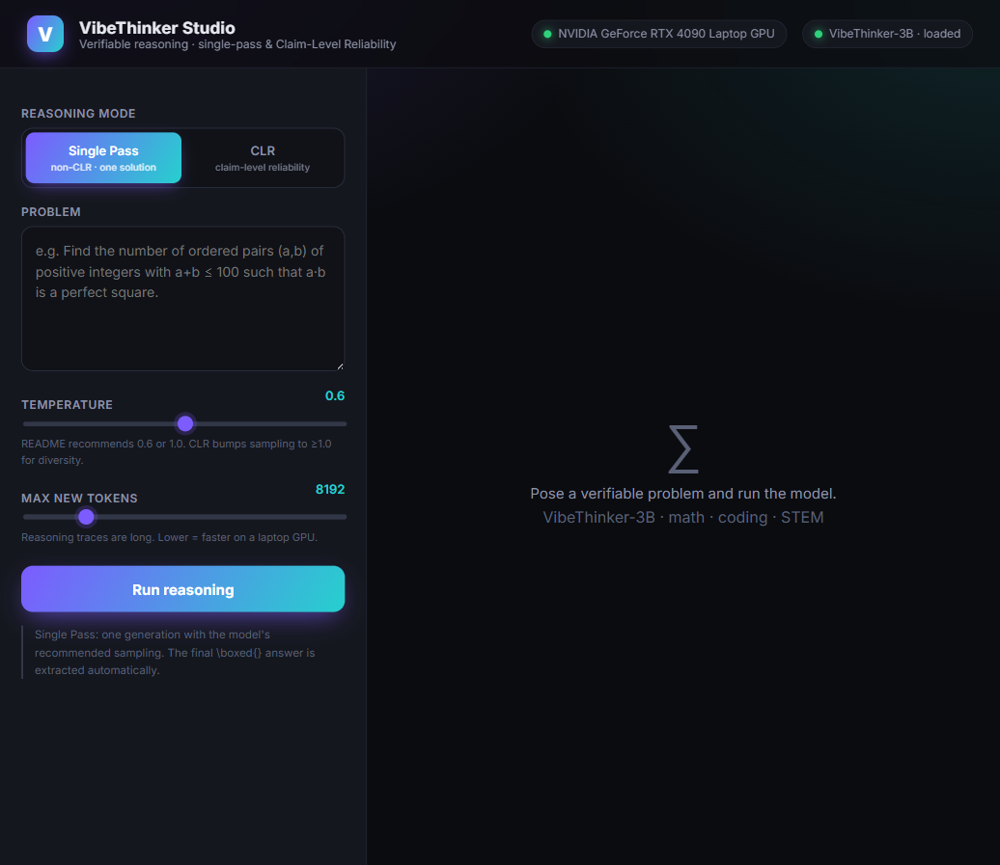
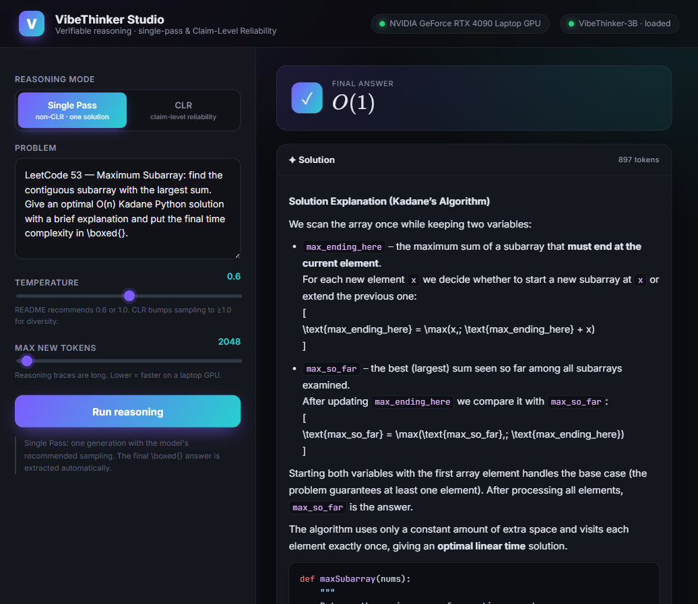
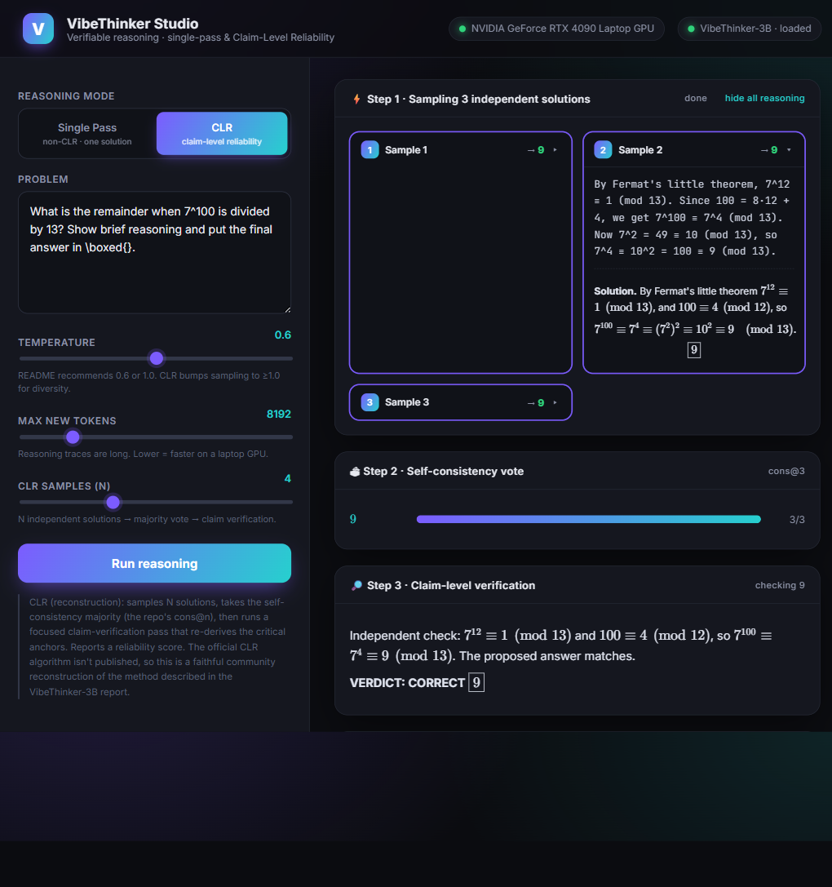

# VibeThinker Studio

A beautiful local web app for running **[VibeThinker-3B](https://github.com/WeiboAI/VibeThinker)**
— Weibo AI's small *verifiable-reasoning* model — in two inference modes, side by side:

| Mode | What it does |
|------|--------------|
| **Single Pass** (non‑CLR) | One generation with the model's recommended sampling. Streams the `<think>` reasoning trace, then renders a clean Markdown **Solution** (with syntax‑highlighted code + KaTeX math) and auto‑extracts the final `\boxed{}` answer. |
| **CLR** (Claim‑Level Reliability) | Samples **N** independent solutions → takes the **self‑consistency majority** (`cons@n`) → runs a focused **claim‑verification** pass that re‑derives the critical anchors → reports a **reliability score** and the selected answer. Each candidate's reasoning trace is **collapsible (show/hide per solution)**, with a "hide all reasoning" toggle; the final card surfaces both the **self‑consistency** pick and the **verified** answer. |

> Both modes use the **same weights** — CLR is an inference‑time strategy, not a different checkpoint.

---

## Screenshots

**Home — pick a mode, model loaded on the GPU**



**Single Pass — a Hard LeetCode problem, rendered Markdown solution + code highlighting + boxed answer**



**CLR — N samples → self‑consistency vote → claim‑level verification → reliability gauge**



---

## What is VibeThinker / CLR?

- **VibeThinker** is a family of small dense reasoning models from Weibo AI built on Qwen2.5
  (1.5B and 3B). Despite their size they reach frontier‑level scores on verifiable benchmarks
  (e.g. VibeThinker‑3B: **94.3** AIME26, **89.3** HMMT25, **80.2** Pass@1 LiveCodeBench v6).
- **CLR (Claim‑Level Reliability Assessment)** is a *test‑time scaling strategy* the VibeThinker‑3B
  report introduces; it lifts AIME26 **94.3 → 97.1**, HMMT25 **89.3 → 95.4**.

> ⚠️ **On the CLR implementation here:** the official repo describes CLR but does **not** publish its
> algorithm or code. This app implements a **faithful community reconstruction** based on the repo's own
> `cons@n` self‑consistency selection (see `eval/math/main_evaluation.py` upstream) plus the paper's
> "isolate critical logical anchors" verification idea. It is **not** the authors' exact implementation.

---

## Requirements

- **Python** with `torch` (CUDA build), `transformers>=4.54`, `fastapi`, `uvicorn`, `accelerate`, `huggingface_hub`.
- A **GPU** is strongly recommended. Verified on an **RTX 4090 Laptop (16 GB)** — the 3B model uses
  ~6 GB VRAM in bfloat16, loads in ~30 s. CPU works but is very slow.

```bash
pip install -r requirements.txt
```

## Download the model weights (not included in this repo)

The checkpoint (~6 GB) is **not** committed here. Download it from Hugging Face into `models/VibeThinker-3B/`:

```bash
# Option A — Python
python -c "from huggingface_hub import snapshot_download; \
snapshot_download('WeiboAI/VibeThinker-3B', local_dir='models/VibeThinker-3B', \
allow_patterns=['*.json','*.txt','*.safetensors','tokenizer*','*.model','vocab*','merges*'])"

# Option B — huggingface-cli
huggingface-cli download WeiboAI/VibeThinker-3B --local-dir models/VibeThinker-3B
```

Model card: <https://huggingface.co/WeiboAI/VibeThinker-3B> · ModelScope mirror:
<https://modelscope.cn/models/WeiboAI/VibeThinker-3B>.
To use the **1.5B** model instead, download `WeiboAI/VibeThinker-1.5B` and set
`MODEL_DIR` / `MODEL_NAME` in `engine.py`.

<details>
<summary>Behind a TLS‑intercepting proxy? (SSL: CERTIFICATE_VERIFY_FAILED)</summary>

Export your OS trust store to a PEM bundle and point Python at it before downloading / running:

```powershell
# Windows PowerShell — export root + intermediate CAs to win-ca-bundle.pem
$o="win-ca-bundle.pem"; $sb=[Text.StringBuilder]::new()
foreach($s in 'Cert:\LocalMachine\Root','Cert:\CurrentUser\Root','Cert:\LocalMachine\CA'){
  Get-ChildItem $s | %{ [void]$sb.AppendLine('-----BEGIN CERTIFICATE-----');
  [void]$sb.AppendLine([Convert]::ToBase64String($_.RawData,'InsertLineBreaks'));
  [void]$sb.AppendLine('-----END CERTIFICATE-----') } }
[IO.File]::WriteAllText($o,$sb.ToString())
```
```bash
export SSL_CERT_FILE=$PWD/win-ca-bundle.pem   # app.py also auto-detects this file
```
(The bundle is git‑ignored — it may contain machine/corporate certificates.)
</details>

## Run

```bash
python app.py
# open http://127.0.0.1:8000
```

The model loads lazily on the first request; the header shows GPU + load status.

---

## Try these (verifiable‑reasoning) prompts

VibeThinker‑3B shines on **competition math** and **coding**. Some hard examples to try:

- *LeetCode Hard 42 — Trapping Rain Water:* optimal O(n) two‑pointer solution.
- *LeetCode Hard 4 — Median of Two Sorted Arrays* in O(log(m+n)).
- *LeetCode Hard 23 — Merge k Sorted Lists.*
- *AIME‑style:* "Find the number of ordered pairs (a,b) of positive integers with a+b ≤ 100 such that a·b is a perfect square."
- *Modular arithmetic (great for CLR):* "What is the remainder when 7^100 is divided by 13?"

> Tip: switch to **CLR** for hard math where a single sample might slip — the vote + verification
> visibly improves reliability. Coding answers stream as rendered Markdown with highlighted code.

## Recommended generation settings (from the official README)

- `temperature` = **0.6 or 1.0**, `top_p` = **0.95**, `top_k` = **‑1 / disabled**
- `max_new_tokens` up to **40960** (reasoning traces are long; the UI defaults to a smaller value for
  snappier laptop runs — raise the slider for hard competition problems).

---

## How it's built

```
.
├─ app.py            # FastAPI: SSE streaming, /api/generate (+_clr), /api/stop, serves the UI
├─ engine.py         # Model loading + non-CLR stream + CLR reconstruction
├─ web/index.html    # Single-page UI: KaTeX + marked + highlight.js, live streaming, CLR viz
├─ docs/             # Screenshots
├─ requirements.txt
└─ models/           # (download separately — git-ignored)
```

Implementation notes:
- `config.json` ships `use_cache=false` (a training leftover); the engine forces `use_cache=True` for usable speed.
- ChatML turns end with `<|im_end|>`; the engine adds it as a stop token alongside `<|endoftext|>`.
- Single GPU → requests are serialized; a new run (or the **Stop** button / `POST /api/stop`) supersedes
  the previous one via a stop event, so reloading frees the GPU instead of blocking.

## License

App code: MIT. Model weights are governed by the upstream
[VibeThinker license](https://github.com/WeiboAI/VibeThinker/blob/main/LICENSE).
This is an unofficial demo and is not affiliated with Weibo AI.
